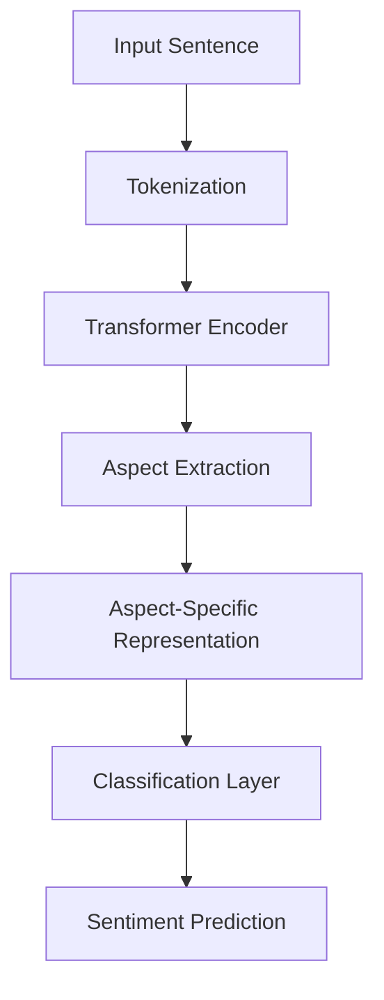
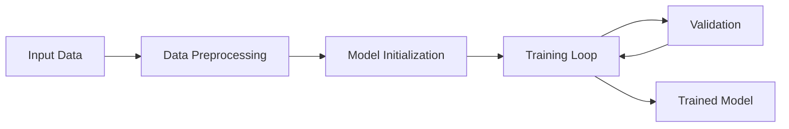

# Aspect-Based Sentiment Analysis Using Transformers

This repository contains an implementation of an Aspect-Based Sentiment Analysis (ABSA) model using Transformer architectures. The model aims to determine the sentiment polarity (positive, negative, neutral) of specific aspects within a given text.

## Table of Contents

- [Introduction](#introduction)
- [Model Architecture](#model-architecture)
- [Dataset Preparation](#dataset-preparation)
- [Installation](#installation)
- [Usage](#usage)
- [Training](#training)
- [Evaluation](#evaluation)
- [Results](#results)
- [Contributing](#contributing)
- [License](#license)

## Introduction

Aspect-Based Sentiment Analysis is a fine-grained sentiment analysis technique that not only determines the overall sentiment of a text but also identifies the sentiment toward specific aspects or features mentioned in the text.

For example, in the sentence:

> "The battery life of this camera is amazing, but the lens quality is disappointing."

The model should identify:

- Aspect: "battery life" - Sentiment: Positive
- Aspect: "lens quality" - Sentiment: Negative

## Model Architecture

Our implementation leverages pre-trained Transformer models (like BERT) to encode textual data and applies a classification layer to predict the sentiment polarity of each aspect.

### High-Level Architecture



### Detailed Workflow

1. **Tokenization**: The input sentence is tokenized using the tokenizer associated with the pre-trained Transformer model.

2. **Transformer Encoding**: The tokenized input is passed through the Transformer encoder to obtain contextualized word embeddings.

3. **Aspect Extraction**: Aspects are identified using a sequence labeling approach or provided externally.

4. **Aspect-Specific Representation**: For each aspect, a representation is generated by pooling the embeddings of tokens corresponding to the aspect.

5. **Classification**: The aspect-specific representation is fed into a classification layer to predict the sentiment polarity.

## Dataset Preparation

The model expects the dataset in the following format:

- **Sentence**: The input text containing one or more aspects.
- **Aspects**: A list of aspects present in the sentence.
- **Sentiments**: Corresponding sentiment labels for each aspect.

### Example

| Sentence                                                     | Aspects                  | Sentiments     |
| ------------------------------------------------------------ | ------------------------ | -------------- |
| "Great food but the service was dreadful and slow."          | ["food", "service"]      | ["Positive", "Negative"] |
| "The screen quality is superb, but the battery drains fast." | ["screen quality", "battery"] | ["Positive", "Negative"] |

## Installation

Clone the repository and install the required packages:

```bash
git clone https://github.com/SurajDonthi/AspectBasedSentimentAnalysis.git
cd AspectBasedSentimentAnalysis
pip install -r requirements.txt
```

## Usage

### Inference

You can use the pre-trained model for inference on new sentences:

```python
from model import AspectSentimentAnalyzer

model = AspectSentimentAnalyzer.load_pretrained('path_to_model')
sentence = "The camera resolution is fantastic, but it's quite bulky."
aspects = ["camera resolution", "size"]
predictions = model.predict(sentence, aspects)
print(predictions)
```

## Training

To train the model on your dataset:

```bash
python train.py --data_path data/dataset.csv --epochs 10 --batch_size 32
```

### Training Pipeline



## Evaluation

Evaluate the model's performance on a test set:

```bash
python evaluate.py --model_path saved_model --test_data data/test_dataset.csv
```

Metrics reported include Accuracy, Precision, Recall, and F1-Score for each sentiment class.

## Results

The model achieves the following performance on the benchmark dataset:

| Metric    | Positive | Negative | Neutral |
| --------- | -------- | -------- | ------- |
| Precision | 85%      | 83%      | 78%     |
| Recall    | 82%      | 80%      | 75%     |
| F1-Score  | 83.5%    | 81.5%    | 76.5%   |

## Contributing

Contributions are welcome! Please open an issue or submit a pull request for any improvements.

## License

This project is licensed under the MIT License.
